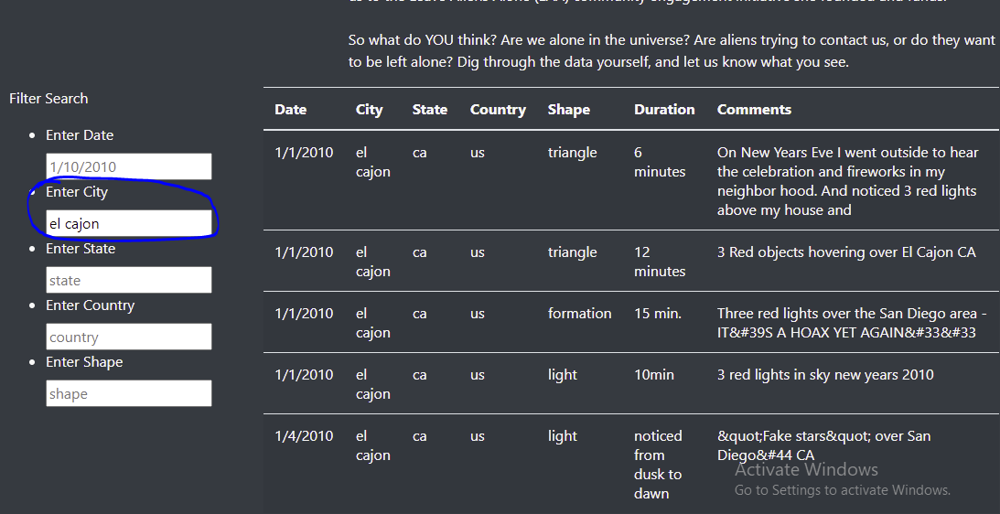

<h1>UFOs</h1>
<h2>Overview</h2>
The purpose of this challenge was to create a webpage that displays UFO sightings. Additionally, I wrote functions in JavaScript to filter the UFO data based off of user input.
<h2>Results</h2>
To perform a search, simply type in a value into any input box and press enter (or click away).   
</img>
<h2>Summary</h2>
One drawback to this webpage is that it is not responsive towards different screen sizes. Thus I recommend adding some formatting to make the text look nicer on smaller screens, and perhaps making the table look nicer (different text / font / background colors, although this will probably require writing a JavaScript function to make a table that is fully customizable).
